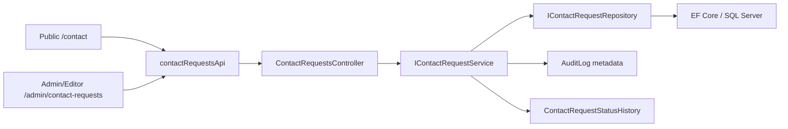

# Kiến trúc, API, workflow và acceptance matrix — Contact Request TV3

## 1. Luồng kiến trúc

Controller chỉ làm HTTP binding, actor/IP, authorization và `ProblemDetails`. Validation, duplicate-window, workflow, audit metadata và mapping nằm ở Application Service. Query EF, `AsNoTracking`, paging, include history và save nằm ở Repository. Đây là ranh giới cần reviewer kiểm tra trước PR.

## 2. HTTP contract chốt

| Endpoint | Quyền | Thành công | Lỗi chính | Mục đích |
|---|---|---|---|---|
| `POST /api/v1/contact-requests` | Anonymous | `201` | `400`, `409`, `429` | Public create, rate-limit theo IP. |
| `GET /api/v1/contact-requests` | `ManageContactRequests` | `200` | `401`, `403`, `400` | List/filter/paging Admin/Editor. |
| `GET /api/v1/contact-requests/{id}` | `ManageContactRequests` | `200` | `401`, `403`, `404` | Detail và history. |
| `POST /api/v1/contact-requests/{id}/status` | `ManageContactRequests` | `200` | `400`, `401`, `403`, `404`, `409` | Đổi trạng thái theo workflow. |

> Status endpoint là **POST**. Controller, API wrapper, frontend, tests, Postman và docs phải dùng cùng contract; không đổi thành PATCH theo module/tài liệu lịch sử khác.

## 3. Workflow authoritative ở backend

| Từ trạng thái | Được phép chuyển tới | Không được phép |
|---|---|---|
| `Pending` | `Contacted`, `Rejected`, `Cancelled` | `Approved`, giữ nguyên status. |
| `Contacted` | `Approved`, `Rejected`, `Cancelled` | `Pending`, giữ nguyên status. |
| `Approved` | Không có | Mọi reopen/chuyển tiếp. |
| `Rejected` | Không có | Mọi reopen/chuyển tiếp. |
| `Cancelled` | Không có | Mọi reopen/chuyển tiếp. |

`Rejected` hoặc `Cancelled` yêu cầu note không rỗng. React chỉ có transition hint UX từ `contact-request-status.ts`; `CanTransition` của backend là nguồn quyết định cuối và trả conflict nếu request sai.

## 4. Validation và bảo mật nghiệp vụ

| Rule | Kết quả API | Test/evidence source |
|---|---|---|
| Full name 2–160, subject 3–180, message 10–4000 | `400 ProblemDetails` nếu sai | Service/controller tests. |
| Email hợp lệ, phone 8–15 digit format | `400 ProblemDetails` nếu sai | Service/E2E validation tests. |
| Duplicate cùng email trong cửa sổ 24 giờ | `409` | Service + controller behavior. |
| Query page/pageSize/status/date range sai | `400` | Service/query API tests. |
| Public submit vượt permit limit | `429 ProblemDetails` | Rate-limit integration test. |
| Customer gọi list/detail/status | `403` | Query API integration test. |
| Anonymous gọi list/detail/status | `401` | Query/controller test. |
| Admin/Editor quản lý Contact | `200` theo endpoint | Query/controller test. |
| Audit create/status | Không lưu full `ContactRequest.Message` | Application audit privacy tests. |

## 5. Persistence review matrix

| Đối tượng | Quan hệ/hiệu năng cần review khi EF sinh migration |
|---|---|
| `ContactRequests` | Main table Contact; optional AppUser FK không được cascade xóa user. |
| `ContactRequestStatusHistories` | FK tới Contact cascade theo configuration; history sortable theo created time. |
| Duplicate query | Index email/date để kiểm tra cửa sổ 24h. |
| List/filter | Index status/date và date desc theo query admin. |
| Migration `Down()` | Chỉ đảo Contact tables/index/FK; không tác động module ngoài Contact. |

Migration phải được EF sinh trên `dev` thật. Không đưa designer/migration overlay cũ vào PR và không sửa migration tay để che model drift.

## 6. Acceptance gate cuối

| Gate | Evidence được chấp nhận | Trạng thái package source |
|---|---|---|
| Source/module | Build/test local trên snapshot | Có source/evidence historical. |
| Migration Contact-only | Diff EF từ branch `dev` thật | Chưa có. |
| Docker DB rỗng | SQL healthy, migrator exit 0, health 200, smoke API | Chưa có. |
| Responsive | E2E 360px + screenshot có nhãn phạm vi | Có local/mock fixture; cần cập nhật evidence Docker/staging nếu đề bài yêu cầu. |
| Git/PR/CI/review | Branch/commit/PR run/reviewer thật | Chưa có. |

DoD không hoàn tất cho đến khi tất cả gate runtime/Git/CI/review có evidence thật.
